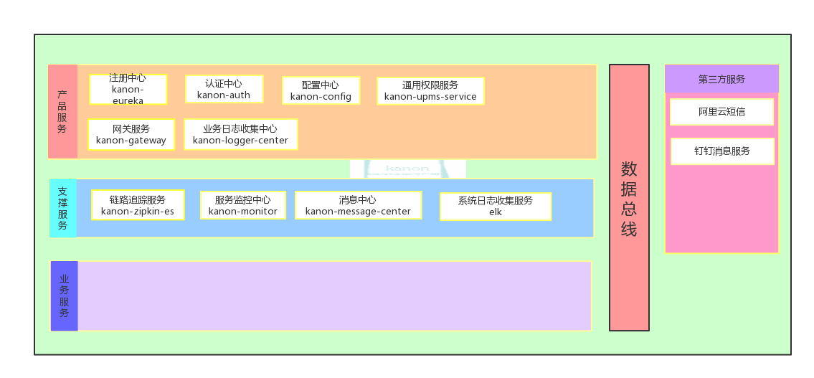
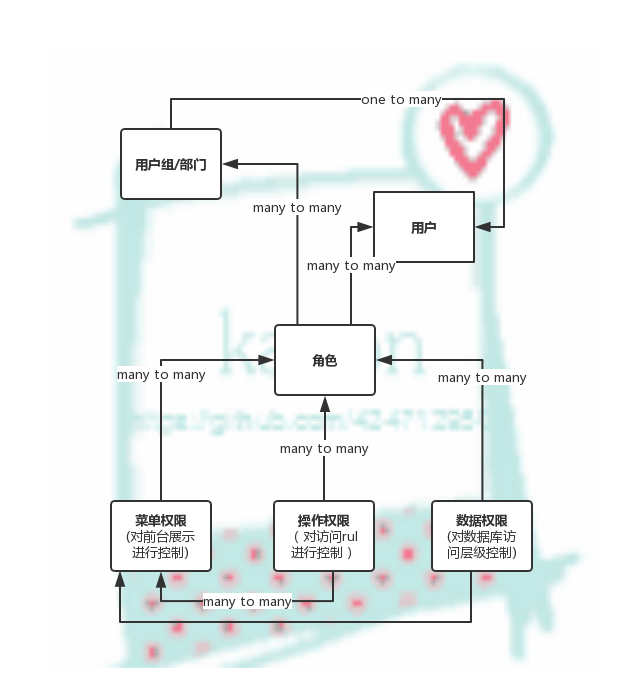

# kanon 微服务企业框架
>* kanon-auth&nbsp;&nbsp;认证服务
>* kanon-common&nbsp;&nbsp;通用包
>* kanon-config&nbsp;&nbsp;配置中心
>* kanon-eureka&nbsp;&nbsp;服务注册中心
>* kanon-gateway&nbsp;&nbsp;网关服务
>* kanon-visual&nbsp;&nbsp;可视化监控服务
>>* kanon-monitor&nbsp;&nbsp;集群监控服务
>>* kanon-zipkib-zipkin-es&nbsp;&nbsp;服务追踪,数据入es
---
 ### 启动方式:
 * 该服务依赖了[aviation-tool工具包](https://github.com/434713950/aviation-tool.git),请先向您的maven仓库安装该工具包
 * 在连接的mysql实例上建立kanon数据库，相应的初始表单会在对应服务启动时自动生成
 * 服务启动顺序:kanon-eureka -> kanon-config ->kanon-auth->kanon-gateway->kanon-visual下的各服务
---
#### 架构体系图

---
### 权限控制体系图

---

*该服务框架参考开源项目pig进行开发
